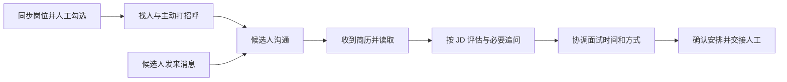
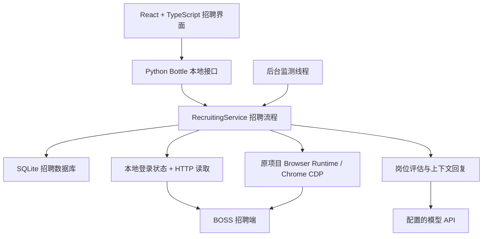

<p align="center">
  基于 <a href="https://github.com/shengjidaguai-china/BossHunter"><strong>BossHunter</strong></a> 的招聘端改造 ·
  <a href="https://github.com/XXm222/BossHunter/tree/recruiting-agent">招聘端开发分支</a>
</p>

<h1 align="center">BossHunter 招聘助手</h1>

<p align="center">
  面向招聘方的面试前工作 Agent：围绕岗位找人、候选人沟通、简历评估和面试安排，减少重复操作。
</p>

<p align="center">
  <a href="https://github.com/XXm222/BossHunter/stargazers"></a>
  <a href="docs/RECRUITING.md"></a>
  <a href="https://www.python.org/"></a>
  <a href="src/bosshunter/web/frontend/package.json"></a>
  <a href="https://github.com/XXm222/BossHunter/commits/recruiting-agent"></a>
</p>

<p align="center">
  🚀 本地运行 · 💬 上下文沟通 · 📄 收到简历自动评估 · 🧭 复用 Chrome 登录状态
</p>

<p align="center">
  ⭐ 欢迎 <a href="https://github.com/XXm222/BossHunter/stargazers"><strong>Star 项目</strong></a>，关注招聘端改造进展。
</p>

**BossHunter 招聘助手**的目标是帮助招聘方完成面试前的工作：读取已发布岗位，由人工选择处理范围；寻找候选人、打招呼、结合上下文回复；收到简历后按岗位 JD 评估，并协调线上或线下面试，最后交接人工。

实际面试、面试评价、定薪、Offer、录用和入职管理不在本项目范围内。

[项目目标与当前进度](docs/RECRUITING.md) · [快速开始](#快速开始) · [界面设计规范](DESIGN.md) · [原项目](https://github.com/shengjidaguai-china/BossHunter)

> [!IMPORTANT]
> 当前为**单公司、单账号的最小样本试运行版**（支持绑定多个候选人会话）。主动打招呼已接通（按额度自动切岗并招呼，真机已验收）；回复自动外发已实现（每会话开关，真机未验收），面试邀约禁止发送。以下会明确区分产品目标与已实现能力，页面上有入口不代表平台动作已验收。

## 核心能力

| 能力 | 说明 | 当前状态 |
|---|---|---|
| 已发布岗位同步 | 从招聘账号读取岗位，由人工勾选允许处理的开放岗位 | 已实现读取与勾选 |
| 主动找人与打招呼 | 按选中岗位寻找候选人，使用平台可用额度或自定义每日上限 | 已实现（真机验收：自动切岗、循环招呼、节流、去重、可停止） |
| 候选人沟通 | 在同一页面查看会话、回复建议、简历评估和面试安排 | 已实现，支持绑定多个会话并切换当前 |
| 上下文回复 | 组合已读取的双方消息、公司说明、岗位 JD、简历和有效评估生成回复草稿 | 流程已实现，真实模型与发送闭环待验收 |
| 收到简历自动评估 | 识别附件、下载 PDF、逐页提取文字，自动调用岗位评估流程 | 已实现，需配置模型与 JD |
| 公司说明 | 一个大文本框维护公司信息，结合各岗位 JD 供回复使用 | 已实现 |
| 消息与简历监测 | 每 120 秒检查当前选中会话，发现简历后自动处理；支持独立进程（`bosshunter recruiting-worker`）持续运行 | 监测按当前选中会话处理 |
| 面试安排 | 在候选人详情中填写线上或线下方式、时间、地址或会议信息 | 仅保存本地安排，禁止发送 |
| 人工接管与运行记录 | 暂停自动处理，保留资料版本、处理状态和异常原因 | 已实现 |

### 招聘流程



上图是最终业务目标。当前已实现部分的详细边界见下表；实际面试及其后的业务交给人工处理。

### 当前能力边界

| 项目 | 当前行为 |
|---|---|
| 平台范围 | 招聘端目前只适配 BOSS 直聘；原项目的多平台求职能力不等于多平台招聘已接入 |
| 每日额度 | 可选择平台额度模式或自定义上限；平台剩余额度可手动读取，不会将保存配置当作启动外发 |
| 额度目标 | 最终以使用当天可用额度为目标；平台限制、暂停和异常优先，不能保证每天一定耗尽 |
| 聊天上下文 | 使用平台当前可返回的消息，明确历史覆盖范围，不声称已读取不可访问的历史 |
| 简历完整性 | PDF 文字层逐页提取；无文字层的扫描件由 OCR 兜底识别（需安装 `ocr` 可选依赖），图片、表格和文字顺序仍需人工核对 |
| 评分依据 | 评价岗位相关的职业证据，保留原文引用和未知项；不使用年龄、性别、婚育或外貌筛选 |
| 自动评分 | 缺模型或 JD 时等待；资料、JD 或模型配置变化后重新评估；相同输入去重，失败不反复调用 |
| 回复与邀约 | 回复支持草稿、人工核对和按会话自动外发（`needs_human` 需人工、按天限额）；面试邀约在执行层禁发 |
| 暂停与恢复 | 人工接管、停止联系或岗位暂停时停止自动处理；结果不明的发送保留待核实状态 |
| 新账号使用 | 已有会话绑定向导（手动填会话标识）；真实账号端到端绑定尚未验收，全新安装仍需按步骤完成绑定 |

## 项目结构图



**本地单体应用，招聘业务独立存储。** 前端与 API 由同一个本地服务提供，招聘数据使用 `recruiting.db`；原求职模块继续保留。

- **后台读取：**使用本地 Chrome 的 BOSS 登录 Cookie 读取岗位、绑定会话和已收到的 PDF，Cookie 仅在内存中使用。
- **页面操作：**复用原项目的 `RuntimeClient → Node Browser Runtime → Chrome CDP`，招聘端已移除 Kimi WebBridge 运行依赖。
- **标签页范围：**只连接明确的现有招聘页面，不自动新建、导航、关闭或激活标签页，不自动切换聊天对象；目标不明确或失效时停止。
- **模型调用：**程序控制流程，模型负责评估和生成内容；配置并运行相关功能后，对应上下文会发往所配置的模型接口。
- **监测方式：**回复监测可跑在独立进程（`bosshunter recruiting-worker`，需另开终端），App 关闭后仍持续；监测状态（上次成功/错误）持久化。App 界面通过控制标志启停，worker 未运行时界面会提示。

[查看招聘端模块说明](docs/RECRUITING.md#技术架构) · [查看招聘业务源码](src/bosshunter/recruiting)

## 快速开始

需要 Python 3.10+、Node.js 22+、Google Chrome，以及用于评分和回复的模型 API。

**当前本地 Cookie 读取实现针对 macOS 的 Chrome 默认配置目录。Windows、Linux 及其他 Chrome 配置目录尚未适配这条招聘读取路径。** 下列命令以 macOS 为例。

```bash
# 获取招聘端分支
git clone --branch recruiting-agent https://github.com/XXm222/BossHunter.git
cd BossHunter

# 创建 Python 环境并安装招聘依赖
python3 -m venv .venv
source .venv/bin/activate
python -m pip install -e '.[recruiting]'

# 安装并构建前端
npm --prefix src/bosshunter/web/frontend ci
npm --prefix src/bosshunter/web/frontend run build

# 启动本地服务
bosshunter web --no-open
```

打开 [招聘工作台](http://127.0.0.1:8686/recruiting)，按以下顺序准备资料与连接：

1. 在本机 Chrome 默认配置中登录 BOSS 招聘端，使用自己的招聘账号。
2. 在“模型设置”配置模型接口和密钥；密钥只在本地填写。
3. 在“公司说明”填写公司资料和岗位 JD，再同步已发布岗位并人工勾选处理范围。勾选目前不会启动自动外发。
4. 在绑定向导中完成会话身份绑定后，在候选人沟通中检查消息、简历及岗位关联，再开启消息与简历监测。绑定时请勿跳过身份核对。
5. 需要页面操作时，按原项目说明准备 Chrome 调试连接和 Browser Runtime；后台 HTTP 读取不依赖这条页面连接。

招聘端入口为 `/recruiting`，原求职工作台保留在 `/jobseeker`。原版文档中的 `bosshunter run`、投递和定制个人简历流程属于求职端，不是招聘端启动步骤。

### 主动打招呼的启动与停止

主动打招呼通过 patchright 自动化你的真实 Chrome。Chrome 111+ 禁止在默认配置目录开启远程调试端口，需用一个独立配置目录、带调试端口启动 Chrome，并在其中登录 BOSS、打开「推荐牛人」页（`/web/chat/recommend`）：

```bash
# 启动自动化 Chrome（独立配置目录 + 调试端口，不影响日常 Chrome）
"/Applications/Google Chrome.app/Contents/MacOS/Google Chrome" --remote-debugging-port=9222 --user-data-dir="$HOME/boss-chrome"
```

```bash
# 启动本地服务
bosshunter web --no-open
```

打开 `http://127.0.0.1:8686/recruiting`，在「岗位与额度」同步并勾选岗位、设置额度，再到「主动打招呼」页点「开始执行」。

> 用了独立 `--user-data-dir`（如上例 `~/boss-chrome`）时，还要在 `config.yaml` 的 `browser` 段加上 `recruiting_user_data_dir: "~/boss-chrome"`，让后台消息同步读 Cookie 时也指向这个目录；否则会读默认 Chrome 配置的 Cookie，出现「BOSS 未接受会话读取请求」。

### 节流与自动外发

招聘端所有自动化动作都带节流，默认值较保守（降低风控/封号风险）。可在 `config.yaml` 的 `recruiting` 段调整：

```yaml
recruiting:
  read_delay_min: 20        # 后台读取间隔 20–40 秒
  read_delay_max: 40
  read_page_delay: 3        # 分页读取每页间隔（秒）
  read_daily_limit: 50      # 单日后台请求上限
  greet_delay_min: 30       # 主动打招呼间隔 30–60 秒
  greet_delay_max: 60
  greet_per_job_min: 1      # 每岗位每轮招呼 1–2 个
  greet_per_job_max: 2
  auto_reply_daily_limit: 10  # 每日自动回复上限
```

**自动外发回复**（候选人发来新消息后自动生成并发送）按**每个会话单独开关**控制：在候选人沟通页「简历请求与联系设置」里开启该会话的「自动外发」。满足以下条件才会自动发：

- 该会话开启了自动外发，且未人工接管、未停止联系；
- 模型未标记 `needs_human`（约面试、事实冲突等会跳过、留草稿）；
- 未超过每日自动回复上限。

其余情况都只生成草稿，等人工核对后手动发送。

**回复监测可跑在独立进程**（App 关闭后仍持续运行）：另开一个终端运行 `bosshunter recruiting-worker`；App 界面「开启/停止消息与简历监测」通过控制标志启停它，worker 未运行时界面会提示先启动。

停止方式：

- **主动打招呼循环**：在「主动打招呼」页点「停止」，或额度用完后自动停；
- **自动化 Chrome**：在该 Chrome 窗口按 `Cmd+Q` 退出；
- **本地服务**：在启动它的终端按 `Ctrl+C`。

### 开发验证

```bash
# 招聘端后端测试
python -m unittest discover -s tests -p 'test_recruiting*.py'

# 前端测试与生产构建
npm --prefix src/bosshunter/web/frontend test
npm --prefix src/bosshunter/web/frontend run build
```

2026-09-27 发布前检查：**69 项招聘后端测试、41 项前端测试和前端构建通过**。这些结果验证代码与隔离场景，真实模型质量、Chrome 页面执行和完整平台业务链仍需分别验收。

## 文档导航

| 文档 | 内容 |
|---|---|
| [招聘端目标与当前进度](docs/RECRUITING.md) | 产品范围、已实现能力、试运行限制与技术结构 |
| [招聘界面设计规范](DESIGN.md) | 蓝白布局、彩色图标、组件与响应式规范 |
| [模型及基础配置参考](docs/CONFIGURATION.md) | 原项目配置说明；其中求职者简历、投递配置不属于招聘流程 |
| [Chrome 连接与安装参考](docs/QUICKSTART.md) | 原项目安装及浏览器连接排错，业务操作部分仍以求职端为主 |
| [原项目 CLI 参考](docs/CLI.md) | 通用命令与原求职命令，不代表招聘端已有对应自动执行能力 |
| [上游版本记录](CHANGELOG.md) | 原项目历史版本与升级说明 |
| [许可证](LICENSE) | 源码使用、修改和分发条款 |

<details>
<summary><strong>招聘端改造记录</strong></summary>

| 日期 | 范围 | 更新内容 |
|---|---|---|
| 2026-09-27 | 浏览器接入与文档 | 页面操作改用原项目 Browser Runtime，移除招聘端 WebBridge 依赖；增加目标与进度文档，发布招聘端分支。 |
| 2026-09-19 | 招聘工作台与流程 | 新增招聘界面、岗位勾选与额度设置、单会话同步、PDF 读取、自动评分流程、上下文回复草稿和公司说明。 |

本分支基于 BossHunter 2.4.0 开发，以上为改造记录，不代表发布了新的完整稳定版本。

</details>

## 🧭 维护与来源

本招聘端改造维护在 [XXm222/BossHunter](https://github.com/XXm222/BossHunter/tree/recruiting-agent) 的 `recruiting-agent` 分支。

感谢 [shengjidaguai-china/BossHunter](https://github.com/shengjidaguai-china/BossHunter) 及其贡献者提供的 Python、Web 工作台、模型接入和 Browser Runtime 基础。上游的维护者名单、贡献榜和历史治理记录保留在原文档中，不作为本招聘分支的维护者或贡献统计。

[上游维护者记录](MAINTAINERS.md) · [上游贡献者记录](CONTRIBUTORS.md) · [原项目](https://github.com/shengjidaguai-china/BossHunter)

## 许可证

本项目沿用原项目的 [PolyForm Noncommercial License 1.0.0](LICENSE)。招聘端改造不改变原许可证的非商业使用限制；商业使用需取得另行授权。

## 参与项目

欢迎 [Star](https://github.com/XXm222/BossHunter/stargazers)，或通过 [Pull Request](https://github.com/XXm222/BossHunter/pulls) 改进招聘端。提交时请说明改动对应的业务流程、验证方式及仍未接通的部分。

- 优先完善准确身份绑定、上下文完整性、简历读取、模型质量及异常恢复。
- 使用合成数据编写测试；不要提交真实简历、聊天截图、候选人联系方式、Cookie、数据库或 API 密钥。
- 保留人工接管、停止联系、结果待核实和面试邀约禁发约束。
- 遇到验证码、登录失效或平台限制时暂停，不加入绕过机制。
- 原求职功能与招聘功能分别说明、分别验收，避免把一方能力当作另一方已完成。
